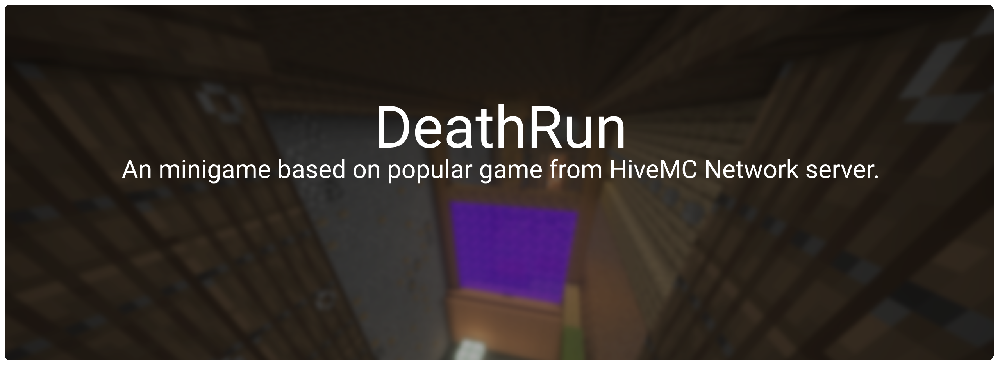

### How can i contribute to DeathRun?
1. Fork repository and create new branch for your feature or bug fix.
2. Make sure your changes are working properly and not causing any conflicts.
3. Commit your changes and push them to your repository fork.
4. Submit a pull request to the main repository in [Pull Requests](https://github.com/MrStudios/DeathRun/pulls) tab.

### Reporting Issues
If you find an issue with plugin, please report it in the [Issues](https://github.com/MrStudios/DeathRun/issues) tab. When reporting an issue, please make sure to follow these guidelines:
* Issue is not caused by your server configuration.
* Issue is not caused by your custom server software and java version.
* Issue is not caused by other plugins and dependencies used by this plugin.

### Pull Request
When submitting a pull request, please make sure to follow these guidelines:
* Make sure that your code adheres to plugin existing coding style.
* Test your changes thoroughly before submitting the pull request.
* If your pull request is related to an existing issue, please reference the issue in your pull request.
* Provide a detailed description of your changes and their motivation.

### License
This repository is licensed under [AGPLv3](LICENSE) license, which means that you are allowed to use this plugin for free _(private & commercial)_ and modify code as you want, but you are not allowed to sell it or claim it as your own work.