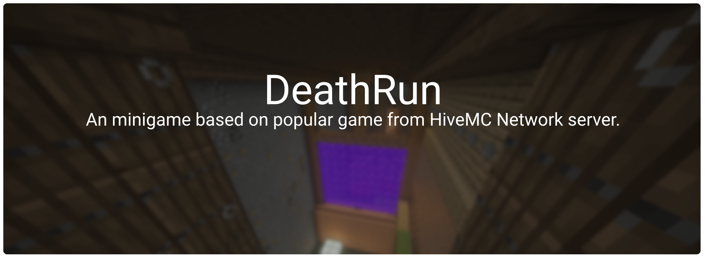

### What is that?
DeathRun is a plugin for well known minigame from the HiveMC Network server where players are divided into two teams, runners and deaths. As a runner, you have to run through the entire map, avoiding traps that is triggered by players with the death role will use against you.

### Information
This plugin works on ``1.16+`` servers with ``Paper`` or ``Spigot`` server software, ``Java 17`` and ``WorldEdit (v7.2.9+)`` plugin.

### Support
If you need support contact us on our [Discord](https://discord.gg/C8dF6zkYff) server or visit our [Documentation](https://www.mrstudios.pl/documentation) page. If you want to contribute this repository please read [CONTRIBUTING](CONTRIBUTING.md) file.

### Configuration

Plugin configuration files using [YAML](https://yaml.org/) format. Configuration files is described bellow.

<details>
    <summary>File: <code>config.yml</code></summary>

```yaml
#  
# ------------------------------------------------------------------------
#                               INFORMATION
# ------------------------------------------------------------------------
#  
#  This is configuration file for DeathRun plugin, if you found any issue 
#  contact with us through Discord or create issue on GitHub. If you need
#  help with configuration visit https://mrstudios.pl/documentation.
#  

# ------------------------------------------------------------------------
#                                GENERAL
# ------------------------------------------------------------------------

# Lobby Server Name
server: dr-lobby-1

# Minimum amount of players that is needed to game start.
arena-min-players: 5

# Amount of players with 'DEATH' role on arena.
arena-deaths-amount: 1

# Amount of time that runners have to complete run. (in seconds)
arena-game-time: 600

# Amount of time that is needed to game start.
arena-pre-starting-time: 30

# Amount of time before start barrier will be removed.
arena-starting-time: 10

# Amount of time before players on server will be moved to lobby.
arena-end-delay: 10

# Amount of time before trap can be used again.
arena-trap-delay: 20

# Amount of time before strafe can be used again.
arena-strafe-delay: 30

# Max ,,survivable`` distance that player can fall.
arena-max-fall-distance: 8

# ------------------------------------------------------------------------
#                                 EFFECTS
# ------------------------------------------------------------------------
block-effects:
  - block: EMERALD_BLOCK
    effect: JUMP
    amplifier: 7
    duration: 1.5
  - block: REDSTONE_BLOCK
    effect: SPEED
    amplifier: 5
    duration: 1.5

# ------------------------------------------------------------------------
#                                SOUNDS
# ------------------------------------------------------------------------
arena-sound-pre-starting: BLOCK_NOTE_BLOCK_PLING
arena-sound-starting: ENTITY_EXPERIENCE_ORB_PICKUP
arena-sound-started: ENTITY_ENDER_DRAGON_GROWL
arena-sound-checkpoint-reached: ENTITY_EXPERIENCE_ORB_PICKUP
arena-sound-trap-delay: ENTITY_VILLAGER_NO
arena-sound-strafe-use: ENTITY_BLAZE_AMBIENT
arena-sound-player-death: ENTITY_SKELETON_DEATH
```

</details>

<details>
    <summary>File: <code>language.yml</code></summary>

```yaml
#  
# ------------------------------------------------------------------------
#                               INFORMATION
# ------------------------------------------------------------------------
#  
#  This is configuration file for DeathRun plugin, if you found any issue 
#  contact with us through Discord or create issue on GitHub. If you need
#  help with configuration visit https://mrstudios.pl/documentation.
#  

# ------------------------------------------------------------------------
#                                  GENERAL
# ------------------------------------------------------------------------
chat-message-no-permissions: <red>You don't have permissions to this command.
chat-message-arena-player-joined: <gray><player> <yellow>has joined. <aqua>(<currentPlayers>/<maxPlayers>)
chat-message-arena-player-left: <gray><player> <yellow>has quit.
chat-message-arena-starting-timer: <yellow>Game starts in <gold><timer> seconds<yellow>.
chat-message-arena-player-finished: <reset> <white><b>FINISH ></b> <gray>Player <gold><player> <gray>has finished game in <white><seconds> seconds<gray>. <dark_gray>(#<finishPosition>)
chat-message-arena-game-start-runner:
  - <reset>
  - <reset>   <gold><b>*</b> <gray>You are <green>Runner<gray>.
  - <reset>   <white><b>*</b> <gray>Your task is complete run in shortest possible time,
    during this task interfering player will trigger various traps.
  - <reset>
chat-message-arena-game-start-death:
  - <reset>
  - <reset>   <gold><b>*</b> <gray>You are <red>Death<gray>.
  - <reset>   <white><b>*</b> <gray>Your task is to disturb runners by launching traps.
  - <reset>
chat-message-game-end-spectator:
  - <reset>
  - <reset>   <gold><b>*</b> <gray>You are <dark_gray>Spectator<gray>.
  - <reset>   <white><b>*</b> <gray>Now you can follow other players.
  - <reset>

# ------------------------------------------------------------------------
#                                  TITLES
# ------------------------------------------------------------------------
arena-pre-starting-title: <red><timer>
arena-pre-starting-subtitle: <reset>
arena-starting-title: <red><timer>
arena-starting-subtitle: <reset>
arena-death-title: <red>YOU DIED!
arena-death-subtitle: <yellow>Don't give up! Try again!
arena-checkpoint-title: <yellow>CHECKPOINT!
arena-checkpoint-subtitle: <gold>You reached <yellow>#<checkpoint> checkpoint<gold>.
arena-finish-title: <dark_aqua><b>FINISH
arena-finish-subtitle: <gray>Your position is <white>#<position><gray>.
arena-game-end-title: <red><b>GAME END!
arena-game-end-subtitle: <reset>
arena-move-server-title: <aqua>Waiting..
arena-move-server-subtitle: <gray>You will be transferred to lobby in <white><endTimer> seconds<gray>.

# ------------------------------------------------------------------------
#                               SCOREBOARD
# ------------------------------------------------------------------------
arena-scoreboard-title: <yellow><b>DEATH RUN
arena-scoreboard-lines-waiting:
  - <reset>
  - '<white>Map: <green><map>'
  - '<white>Players: <green><currentPlayers>/<maxPlayers>'
  - <reset>
  - <white>Waiting..
  - <reset>
  - <yellow>www.mrstudios.pl
arena-scoreboard-lines-starting:
  - <reset>
  - '<white>Map: <green><map>'
  - '<white>Players: <green><currentPlayers>/<maxPlayers>'
  - <reset>
  - <white>Start in <green><timer> seconds
  - <reset>
  - <yellow>www.mrstudios.pl
arena-scoreboard-lines-playing:
  - <reset>
  - '<white>Time: <green><timeFormatted>'
  - '<white>Role: <green><role>'
  - <reset>
  - '<white>Runners: <green><runners>'
  - '<white>Deaths: <red><deaths>'
  - <reset>
  - '<white>Map: <green><map>'
  - <reset>
  - <yellow>www.mrstudios.pl

# ------------------------------------------------------------------------
#                               HOLOGRAMS
# ------------------------------------------------------------------------
arena-hologram-trap-delayed: <red><delay> seconds

# ------------------------------------------------------------------------
#                                 ROLES
# ------------------------------------------------------------------------
arena-roles-runner-name: <green>Runner
arena-roles-death-name: <red>Death
arena-roles-spectator-name: <gray>Spectator

# ------------------------------------------------------------------------
#                                 ITEMS
# ------------------------------------------------------------------------
arena-item-teleport-name: <green>Teleport <gray>(Right Click)
arena-item-strafe-left-available-name: <green>Strafe Left <gray>(Right Click)
arena-item-strafe-left-unavailable-name: <green>Strafe Left <dark_gray>(<delay> seconds)
arena-item-strafe-back-available-name: <green>Strafe Back <gray>(Right Click)
arena-item-strafe-back-unavailable-name: <green>Strafe Back <dark_gray>(<delay> seconds)
arena-item-strafe-right-available-name: <green>Strafe Right <gray>(Right Click)
arena-item-strafe-right-unavailable-name: <green>Strafe Right <dark_gray>(<delay> seconds)
arena-item-leave-name: <red>Leave <gray>(Right Click)
```

</details>

### Sponsoring
If you want to sponsor this project you can do it by clicking ``Sponsor`` button. You can also support us by clicking on the star button on the top of this page.

### Used Libraries
Libraries that is used in this project, most of them are open source libraries.
- [LiteCommands](https://github.com/Rollczi/LiteCommands) by Rollczi
- [ProtocolSidebar](https://github.com/CatCoderr/ProtocolSidebar) by CatCoderr
- [Kyori Adventure](https://github.com/KyoriPowered/adventure) by Kyori
- [Java Annotations](https://github.com/JetBrains/java-annotations) by JetBrains
- [lombok](https://github.com/projectlombok/lombok) by Project Lombok
- [okaeri-configs](https://github.com/OkaeriPoland/okaeri-configs) by Okaeri
- [commons-io](https://github.com/apache/commons-io) by Apache Software Foundation